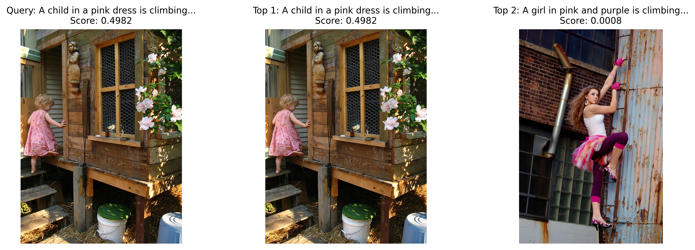
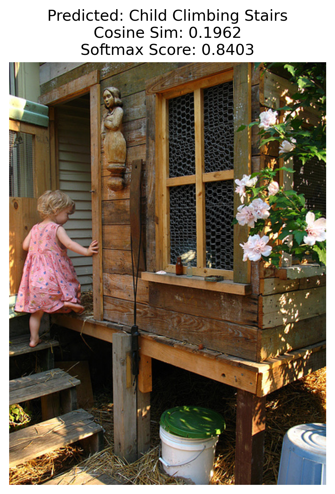

## Results

Here are the key results from the project, including visualizations generated by the scripts.

### Image-to-Text Retrieval
The fine-tuned CLIP model was used to retrieve captions for a test image (`1000268201_693b08cb0e.jpg`). The ground-truth caption was ranked #1 with a cosine similarity of 0.6102, indicating good alignment but room for improvement (ideal similarity: 0.9–1.0).

**Results**:
- **Raw Cosine Similarities**: Max 0.6102, Min -0.2820
- **Softmax Scores (temperature=0.02)**: Max 0.4900
- **Test Image Info**:
  - Caption: "A child in a pink dress is climbing up a set of stairs in an entry way." (cosine_sim=0.6102)
  - Ground-truth ranked #1
- **Top-2 Matches**:
  - Rank 1: "A child in a pink dress is climbing up a set of stairs in an entry way." (cosine_sim=0.6102)
  - Rank 2: "A girl in pink and purple is climbing a ladder." (cosine_sim=0.5500)

**Visualization**:

### Zero-Shot Classification
The pre-trained CLIP model was used for zero-shot classification with ensemble prompts and a temperature of 0.04. The test image was correctly classified as "Child Climbing Stairs," but the cosine similarity was low (0.2770), suggesting potential issues with prompt alignment or image complexity.

**Results**:
- **Raw Cosine Similarities**:
  - Child Climbing Stairs: 0.2770
  - Dog Running: 0.1383
  - Person Swimming: 0.1668
  - Car on Road: 0.1211
- **Softmax Scores (temperature=0.04)**:
  - Child Climbing Stairs: 0.9200
  - Dog Running: 0.0300
  - Person Swimming: 0.0400
  - Car on Road: 0.0100

**Visualization**:

